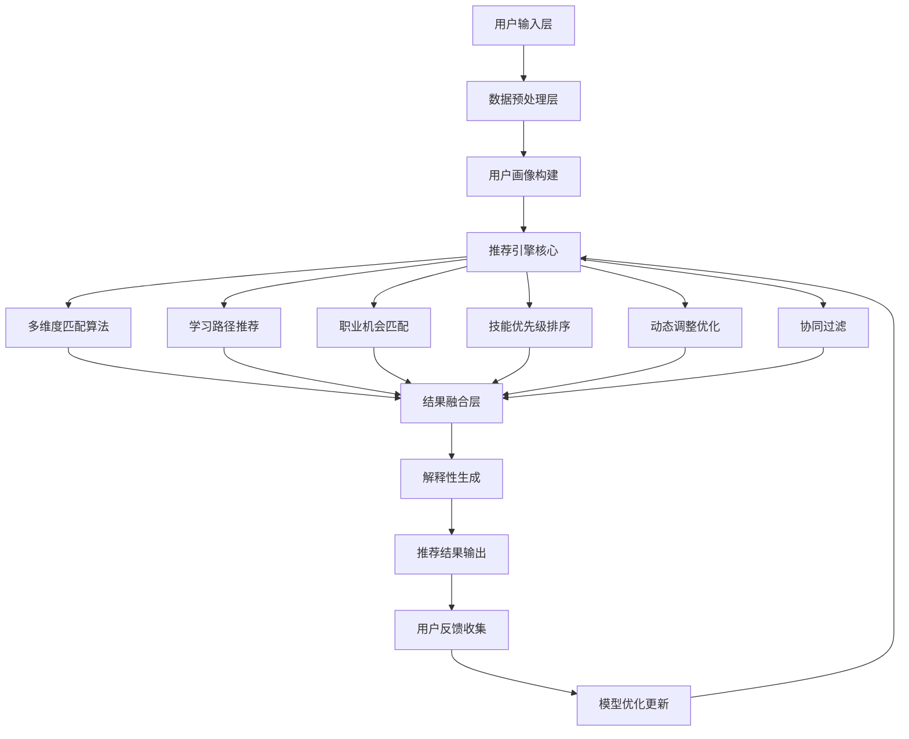

# 智能推荐算法系统设计

## 目录
1. [系统概述](#系统概述)
2. [架构设计](#架构设计)
3. [多维度匹配算法](#多维度匹配算法)
4. [个性化学习路径推荐算法](#个性化学习路径推荐算法)
5. [职业机会匹配和推荐系统](#职业机会匹配和推荐系统)
6. [技能提升优先级排序算法](#技能提升优先级排序算法)
7. [动态目标调整和路径优化算法](#动态目标调整和路径优化算法)
8. [协同过滤和内容推荐算法](#协同过滤和内容推荐算法)
9. [推荐结果解释性和可操作性设计](#推荐结果解释性和可操作性设计)
10. [系统实现方案](#系统实现方案)
11. [API接口设计](#API接口设计)
12. [性能优化和扩展](#性能优化和扩展)

---

## 系统概述

### 设计目标
本系统旨在为AI领域从业者提供智能化、个性化的职业发展建议，通过多维度用户画像分析、机器学习算法和知识图谱技术，为用户推荐最适合的学习路径、职业机会和技能提升方案。

### 核心特性
- **多维度用户画像**：结合技能水平、性格特质、经验背景、学习能力等多个维度
- **个性化推荐**：基于用户画像和目标提供定制化建议
- **动态调整**：根据用户反馈和进展动态优化推荐策略
- **可解释性**：提供推荐理由和具体行动指导
- **实时更新**：跟踪行业趋势和市场变化，更新推荐内容

### 应用场景
1. 职业规划指导
2. 学习路径规划
3. 技能发展建议
4. 职位匹配推荐
5. 培训课程推荐
6. 项目机会匹配

---

## 架构设计

### 整体架构



### 核心组件

#### 1. 数据层
- **用户数据库**：存储用户基本信息、评估结果、历史行为
- **知识图谱**：AI领域技能、职位、课程、公司等实体关系
- **内容库**：学习资源、职位信息、行业报告等
- **反馈数据**：用户对推荐结果的反馈和行为数据

#### 2. 算法层
- **用户画像算法**：多维度特征提取和表示学习
- **匹配算法**：基于相似度计算的多维度匹配
- **排序算法**：机器学习排序模型
- **协同过滤算法**：基于用户行为的推荐
- **深度学习模型**：神经网络推荐模型

#### 3. 服务层
- **推荐服务**：核心推荐逻辑
- **评估服务**：用户画像评估和更新
- **内容服务**：推荐内容管理
- **反馈服务**：用户反馈处理
- **缓存服务**：推荐结果缓存

### 技术栈选择

#### 后端技术
- **编程语言**：Python (算法开发) + Node.js (API服务)
- **机器学习框架**：TensorFlow/PyTorch + scikit-learn
- **数据库**：PostgreSQL (关系数据) + Neo4j (知识图谱) + Redis (缓存)
- **消息队列**：Apache Kafka
- **搜索引擎**：Elasticsearch

#### 前端技术
- **框架**：React.js + TypeScript
- **可视化**：D3.js + Chart.js
- **UI组件**：Ant Design

#### 部署运维
- **容器化**：Docker + Kubernetes
- **云平台**：AWS/阿里云
- **监控**：Prometheus + Grafana
- **日志**：ELK Stack

---

## 多维度匹配算法

### 算法概述
多维度匹配算法是推荐系统的核心，通过分析用户的技能水平、性格特质、经验背景、学习偏好等多个维度，计算用户与不同职业发展选项的匹配度。

### 用户画像维度

#### 1. 技能维度 (Skills Dimension)
```python
class SkillsDimension:
    def __init__(self):
        self.technical_skills = {
            'programming': ['python', 'java', 'javascript', 'cpp'],
            'ml_algorithms': ['supervised_learning', 'unsupervised_learning', 'deep_learning'],
            'frameworks': ['tensorflow', 'pytorch', 'scikit_learn'],
            'tools': ['git', 'docker', 'kubernetes'],
            'domains': ['nlp', 'cv', 'recommendation', 'autonomous_driving']
        }
        
    def calculate_skill_vector(self, user_skills):
        """
        计算用户技能向量
        """
        skill_vector = {}
        for category, skills in self.technical_skills.items():
            category_scores = []
            for skill in skills:
                score = user_skills.get(skill, 0)  # 0-10评分
                category_scores.append(score)
            skill_vector[category] = {
                'max_score': max(category_scores) if category_scores else 0,
                'avg_score': sum(category_scores) / len(category_scores) if category_scores else 0,
                'breadth': len([s for s in category_scores if s > 5])  # 超过中等水平的技能数量
            }
        return skill_vector
```

#### 2. 性格维度 (Personality Dimension)
```python
class PersonalityDimension:
    def __init__(self):
        self.mbti_career_matching = {
            'INTJ': {
                'technical_roles': 0.9,
                'management_roles': 0.8,
                'research_roles': 0.95,
                'sales_roles': 0.3
            },
            'ENTJ': {
                'technical_roles': 0.7,
                'management_roles': 0.95,
                'research_roles': 0.6,
                'sales_roles': 0.8
            }
            # ... 其他MBTI类型
        }
        
    def get_personality_preferences(self, mbti_type):
        """
        根据MBTI类型获取职业偏好
        """
        return self.mbti_career_matching.get(mbti_type, {})
        
    def calculate_work_style_score(self, personality_traits):
        """
        计算工作风格匹配分数
        """
        work_styles = {
            'independent_work': (personality_traits['introversion'] + personality_traits['thinking']) / 2,
            'team_collaboration': (personality_traits['extraversion'] + personality_traits['feeling']) / 2,
            'structured_environment': (personality_traits['judging'] + personality_traits['sensing']) / 2,
            'flexible_environment': (personality_traits['perceiving'] + personality_traits['intuition']) / 2
        }
        return work_styles
```

#### 3. 经验维度 (Experience Dimension)
```python
class ExperienceDimension:
    def __init__(self):
        self.experience_weights = {
            'years_of_experience': 0.3,
            'project_complexity': 0.25,
            'leadership_experience': 0.2,
            'industry_diversity': 0.15,
            'achievement_quality': 0.1
        }
        
    def calculate_experience_score(self, experience_data):
        """
        计算经验综合评分
        """
        scores = {}
        
        # 工作年限评分
        years = experience_data.get('years_of_experience', 0)
        scores['years_score'] = min(years / 10, 1.0)  # 最高10年经验
        
        # 项目复杂度评分
        project_complexity = experience_data.get('max_project_complexity', 1)  # 1-5评分
        scores['complexity_score'] = project_complexity / 5
        
        # 领导力经验评分
        team_size = experience_data.get('max_team_size', 0)
        scores['leadership_score'] = min(team_size / 50, 1.0)  # 最高50人团队
        
        # 行业多样性评分
        industries = experience_data.get('industries', [])
        scores['diversity_score'] = min(len(industries) / 5, 1.0)  # 最高5个行业
        
        # 成就质量评分
        achievements = experience_data.get('achievement_scores', [])
        scores['achievement_score'] = sum(achievements) / (len(achievements) * 10) if achievements else 0
        
        # 加权总分
        total_score = sum(scores[key] * self.experience_weights[key.replace('_score', '')] 
                         for key in scores.keys())
        
        return total_score, scores
```

#### 4. 学习能力维度 (Learning Dimension)
```python
class LearningDimension:
    def __init__(self):
        self.learning_factors = {
            'learning_speed': 0.3,
            'adaptability': 0.25,
            'curiosity': 0.2,
            'persistence': 0.15,
            'self_direction': 0.1
        }
        
    def assess_learning_capability(self, learning_data):
        """
        评估学习能力
        """
        learning_score = 0
        for factor, weight in self.learning_factors.items():
            score = learning_data.get(factor, 5)  # 1-10评分，默认5
            learning_score += (score / 10) * weight
            
        return learning_score
```

### 多维度匹配核心算法

```python
import numpy as np
from sklearn.metrics.pairwise import cosine_similarity
from sklearn.preprocessing import StandardScaler

class MultiDimensionalMatcher:
    def __init__(self):
        self.skills_dim = SkillsDimension()
        self.personality_dim = PersonalityDimension()
        self.experience_dim = ExperienceDimension()
        self.learning_dim = LearningDimension()
        
        # 维度权重可根据推荐场景调整
        self.dimension_weights = {
            'skills': 0.4,
            'personality': 0.25,
            'experience': 0.2,
            'learning': 0.15
        }
        
    def create_user_profile_vector(self, user_data):
        """
        创建用户画像向量
        """
        # 技能向量
        skill_vector = self.skills_dim.calculate_skill_vector(user_data['skills'])
        skills_features = self._flatten_skill_vector(skill_vector)
        
        # 性格向量
        personality_prefs = self.personality_dim.get_personality_preferences(user_data['mbti_type'])
        work_styles = self.personality_dim.calculate_work_style_score(user_data['personality_traits'])
        personality_features = list(personality_prefs.values()) + list(work_styles.values())
        
        # 经验向量
        exp_score, exp_details = self.experience_dim.calculate_experience_score(user_data['experience'])
        experience_features = [exp_score] + list(exp_details.values())
        
        # 学习能力向量
        learning_score = self.learning_dim.assess_learning_capability(user_data['learning'])
        learning_features = [learning_score]
        
        # 合并所有特征
        user_vector = {
            'skills': np.array(skills_features),
            'personality': np.array(personality_features),
            'experience': np.array(experience_features),
            'learning': np.array(learning_features)
        }
        
        return user_vector
        
    def calculate_career_match_score(self, user_vector, career_requirements):
        """
        计算用户与职业要求的匹配度
        """
        total_score = 0
        detailed_scores = {}
        
        for dimension, weight in self.dimension_weights.items():
            if dimension in user_vector and dimension in career_requirements:
                # 使用余弦相似度计算匹配度
                user_features = user_vector[dimension].reshape(1, -1)
                career_features = career_requirements[dimension].reshape(1, -1)
                
                similarity = cosine_similarity(user_features, career_features)[0][0]
                dimension_score = max(0, similarity)  # 确保非负
                
                detailed_scores[dimension] = dimension_score
                total_score += dimension_score * weight
        
        return total_score, detailed_scores
        
    def find_best_matches(self, user_data, career_options, top_k=10):
        """
        找到最佳匹配的职业选项
        """
        user_vector = self.create_user_profile_vector(user_data)
        matches = []
        
        for career_id, career_info in career_options.items():
            match_score, detailed_scores = self.calculate_career_match_score(
                user_vector, career_info['requirements']
            )
            
            matches.append({
                'career_id': career_id,
                'career_info': career_info,
                'total_score': match_score,
                'detailed_scores': detailed_scores
            })
        
        # 按匹配度排序
        matches.sort(key=lambda x: x['total_score'], reverse=True)
        
        return matches[:top_k]
    
    def _flatten_skill_vector(self, skill_vector):
        """
        将技能向量扁平化为特征列表
        """
        features = []
        for category, scores in skill_vector.items():
            features.extend([scores['max_score'], scores['avg_score'], scores['breadth']])
        return features
```

### 匹配算法优化

#### 1. 特征权重自适应调整
```python
class AdaptiveWeightAdjuster:
    def __init__(self):
        self.feedback_history = []
        
    def adjust_weights_based_on_feedback(self, current_weights, feedback_data):
        """
        基于用户反馈调整权重
        """
        # 分析哪些维度的匹配更受用户欢迎
        positive_feedback = [f for f in feedback_data if f['rating'] >= 4]
        
        if len(positive_feedback) > 10:  # 足够的反馈样本
            dimension_performance = {}
            
            for dimension in current_weights.keys():
                avg_score = np.mean([f['detailed_scores'][dimension] 
                                   for f in positive_feedback if dimension in f['detailed_scores']])
                dimension_performance[dimension] = avg_score
            
            # 根据表现调整权重
            total_performance = sum(dimension_performance.values())
            new_weights = {}
            
            for dimension, performance in dimension_performance.items():
                adjustment_factor = performance / total_performance
                new_weights[dimension] = current_weights[dimension] * (1 + 0.1 * adjustment_factor)
            
            # 归一化权重
            total_weight = sum(new_weights.values())
            for dimension in new_weights:
                new_weights[dimension] /= total_weight
                
            return new_weights
        
        return current_weights
```

#### 2. 动态特征选择
```python
class DynamicFeatureSelector:
    def __init__(self):
        self.feature_importance = {}
        
    def select_important_features(self, user_vectors, career_matches, feedback_scores):
        """
        基于反馈选择重要特征
        """
        from sklearn.ensemble import RandomForestRegressor
        
        # 准备训练数据
        X = []
        y = []
        
        for i, user_vector in enumerate(user_vectors):
            # 将所有维度特征合并
            features = np.concatenate([user_vector[dim] for dim in user_vector.keys()])
            X.append(features)
            y.append(feedback_scores[i])
        
        X = np.array(X)
        y = np.array(y)
        
        # 训练随机森林回归器
        rf = RandomForestRegressor(n_estimators=100, random_state=42)
        rf.fit(X, y)
        
        # 获取特征重要性
        feature_importance = rf.feature_importances_
        
        # 选择重要特征（前80%重要性）
        sorted_indices = np.argsort(feature_importance)[::-1]
        cumsum = np.cumsum(feature_importance[sorted_indices])
        cutoff_idx = np.where(cumsum >= 0.8)[0][0]
        
        important_features = sorted_indices[:cutoff_idx+1]
        
        return important_features
```

---

## 个性化学习路径推荐算法

### 算法设计思路
个性化学习路径推荐算法根据用户当前技能水平、学习目标、性格特征和时间约束，生成定制化的学习计划。算法结合了知识图谱、序列推荐和强化学习技术。

### 知识图谱构建

#### 1. 技能知识图谱
```python
import networkx as nx
from collections import defaultdict

class SkillKnowledgeGraph:
    def __init__(self):
        self.graph = nx.DiGraph()
        self.skill_categories = {
            'programming': ['python', 'java', 'javascript', 'cpp', 'go'],
            'math': ['linear_algebra', 'statistics', 'calculus', 'optimization'],
            'ml_basic': ['supervised_learning', 'unsupervised_learning', 'feature_engineering'],
            'ml_advanced': ['deep_learning', 'reinforcement_learning', 'ensemble_methods'],
            'nlp': ['text_processing', 'language_models', 'transformer', 'bert', 'gpt'],
            'cv': ['image_processing', 'cnn', 'object_detection', 'image_generation'],
            'tools': ['git', 'docker', 'kubernetes', 'aws', 'tensorflow', 'pytorch'],
            'soft_skills': ['communication', 'leadership', 'project_management', 'business_acumen']
        }
        self.build_graph()
        
    def build_graph(self):
        """
        构建技能依赖关系图
        """
        # 添加节点
        for category, skills in self.skill_categories.items():
            for skill in skills:
                self.graph.add_node(skill, category=category)
        
        # 添加依赖关系（有向边）
        dependencies = [
            # 编程基础依赖
            ('python', 'supervised_learning'),
            ('statistics', 'supervised_learning'),
            ('linear_algebra', 'deep_learning'),
            ('supervised_learning', 'deep_learning'),
            
            # 深度学习依赖
            ('deep_learning', 'transformer'),
            ('deep_learning', 'cnn'),
            ('transformer', 'bert'),
            ('transformer', 'gpt'),
            ('cnn', 'object_detection'),
            
            # 工具依赖
            ('python', 'tensorflow'),
            ('python', 'pytorch'),
            ('git', 'docker'),
            ('docker', 'kubernetes'),
            
            # 软技能进阶
            ('communication', 'leadership'),
            ('leadership', 'project_management')
        ]
        
        for prereq, skill in dependencies:
            self.graph.add_edge(prereq, skill, relation='prerequisite')
            
    def get_learning_path(self, current_skills, target_skills):
        """
        计算从当前技能到目标技能的学习路径
        """
        paths = []
        
        for target in target_skills:
            if target not in self.graph:
                continue
                
            # 找到到达目标技能的所有前置技能
            prerequisites = self.get_prerequisites(target)
            
            # 过滤掉已掌握的技能
            missing_skills = [skill for skill in prerequisites 
                            if skill not in current_skills or current_skills[skill] < 6]
            
            if missing_skills:
                # 按依赖关系排序
                ordered_path = self.topological_sort_path(missing_skills + [target])
                paths.append({
                    'target': target,
                    'path': ordered_path,
                    'estimated_time': self.estimate_learning_time(ordered_path)
                })
        
        return paths
    
    def get_prerequisites(self, skill):
        """
        获取技能的所有前置要求
        """
        prerequisites = []
        visited = set()
        
        def dfs(node):
            if node in visited:
                return
            visited.add(node)
            
            for pred in self.graph.predecessors(node):
                prerequisites.append(pred)
                dfs(pred)
        
        dfs(skill)
        return list(set(prerequisites))
    
    def topological_sort_path(self, skills):
        """
        对技能路径进行拓扑排序
        """
        subgraph = self.graph.subgraph(skills)
        try:
            return list(nx.topological_sort(subgraph))
        except nx.NetworkXError:
            # 如果有环，使用近似排序
            return skills
            
    def estimate_learning_time(self, path):
        """
        估算学习路径所需时间
        """
        time_estimates = {
            'programming': 4,  # 周
            'math': 6,
            'ml_basic': 8,
            'ml_advanced': 12,
            'nlp': 10,
            'cv': 10,
            'tools': 2,
            'soft_skills': 4
        }
        
        total_time = 0
        for skill in path:
            category = self.graph.nodes[skill].get('category', 'tools')
            total_time += time_estimates.get(category, 4)
            
        return total_time
```

### 学习路径推荐算法

#### 1. 基于强化学习的路径优化
```python
import numpy as np
from collections import deque
import random

class LearningPathOptimizer:
    def __init__(self, skill_graph):
        self.skill_graph = skill_graph
        self.q_table = defaultdict(lambda: defaultdict(float))
        self.learning_rate = 0.1
        self.discount_factor = 0.9
        self.epsilon = 0.1
        
    def get_state_representation(self, current_skills, target_skills, time_budget):
        """
        获取当前状态的表示
        """
        # 计算技能完成度
        skill_completion = sum(current_skills.values()) / (len(current_skills) * 10)
        
        # 计算距离目标的差距
        target_gap = 0
        for skill in target_skills:
            current_level = current_skills.get(skill, 0)
            target_level = target_skills[skill]
            target_gap += max(0, target_level - current_level)
        
        # 时间预算比例
        estimated_time = self.skill_graph.estimate_learning_time(list(target_skills.keys()))
        time_ratio = time_budget / max(estimated_time, 1)
        
        state = (
            round(skill_completion, 2),
            round(target_gap, 2),
            round(time_ratio, 2)
        )
        
        return state
    
    def get_possible_actions(self, current_skills, target_skills):
        """
        获取可能的学习动作
        """
        actions = []
        
        for skill in target_skills:
            if current_skills.get(skill, 0) < target_skills[skill]:
                # 检查前置条件是否满足
                prerequisites = self.skill_graph.get_prerequisites(skill)
                if all(current_skills.get(pre, 0) >= 6 for pre in prerequisites):
                    actions.append(skill)
        
        return actions
    
    def choose_action(self, state, possible_actions):
        """
        选择学习动作（epsilon-greedy策略）
        """
        if random.random() < self.epsilon or not possible_actions:
            return random.choice(possible_actions) if possible_actions else None
        
        # 选择Q值最高的动作
        q_values = [self.q_table[state][action] for action in possible_actions]
        max_q = max(q_values)
        best_actions = [action for action, q in zip(possible_actions, q_values) if q == max_q]
        
        return random.choice(best_actions)
    
    def update_q_table(self, state, action, reward, next_state, next_actions):
        """
        更新Q表
        """
        current_q = self.q_table[state][action]
        
        if next_actions:
            max_next_q = max(self.q_table[next_state][next_action] for next_action in next_actions)
        else:
            max_next_q = 0
        
        new_q = current_q + self.learning_rate * (reward + self.discount_factor * max_next_q - current_q)
        self.q_table[state][action] = new_q
    
    def optimize_learning_path(self, user_profile, target_skills, time_budget, episodes=1000):
        """
        优化学习路径
        """
        best_path = []
        best_reward = float('-inf')
        
        for episode in range(episodes):
            current_skills = user_profile['skills'].copy()
            path = []
            total_reward = 0
            week = 0
            
            while week < time_budget and any(current_skills.get(skill, 0) < target_skills[skill] 
                                           for skill in target_skills):
                state = self.get_state_representation(current_skills, target_skills, time_budget - week)
                possible_actions = self.get_possible_actions(current_skills, target_skills)
                
                if not possible_actions:
                    break
                
                action = self.choose_action(state, possible_actions)
                if action is None:
                    break
                
                path.append(action)
                
                # 模拟学习效果
                learning_effectiveness = self.simulate_learning(user_profile, action)
                current_skills[action] = min(10, current_skills.get(action, 0) + learning_effectiveness)
                
                # 计算奖励
                reward = self.calculate_reward(current_skills, target_skills, action, week, time_budget)
                total_reward += reward
                
                # 更新状态
                week += self.get_skill_learning_time(action)
                next_state = self.get_state_representation(current_skills, target_skills, time_budget - week)
                next_actions = self.get_possible_actions(current_skills, target_skills)
                
                # 更新Q表
                self.update_q_table(state, action, reward, next_state, next_actions)
            
            if total_reward > best_reward:
                best_reward = total_reward
                best_path = path.copy()
        
        return best_path, best_reward
    
    def simulate_learning(self, user_profile, skill):
        """
        模拟学习效果
        """
        base_effectiveness = 2.0  # 基础学习效果
        
        # 根据学习能力调整
        learning_ability = user_profile.get('learning_score', 0.5)
        effectiveness = base_effectiveness * (0.5 + learning_ability)
        
        # 根据相关技能调整
        related_skills = self.get_related_skills(skill)
        related_boost = sum(user_profile['skills'].get(rs, 0) for rs in related_skills) / len(related_skills) / 10
        effectiveness *= (1 + related_boost * 0.3)
        
        return min(effectiveness, 4.0)  # 单次学习最多提升4分
    
    def calculate_reward(self, current_skills, target_skills, action, current_week, time_budget):
        """
        计算奖励函数
        """
        # 基础奖励：朝目标前进
        skill_improvement = min(current_skills.get(action, 0), target_skills.get(action, 10))
        base_reward = skill_improvement / 10
        
        # 时间效率奖励
        time_efficiency = (time_budget - current_week) / time_budget
        time_reward = base_reward * time_efficiency
        
        # 完成目标奖励
        completion_bonus = 0
        if all(current_skills.get(skill, 0) >= target_skills[skill] for skill in target_skills):
            completion_bonus = 10
        
        return base_reward + time_reward + completion_bonus
```

#### 2. 个性化学习资源推荐
```python
class PersonalizedResourceRecommender:
    def __init__(self):
        self.learning_styles = {
            'visual': ['video_course', 'infographic', 'diagram', 'flowchart'],
            'auditory': ['podcast', 'audio_book', 'webinar', 'discussion'],
            'kinesthetic': ['hands_on_project', 'lab', 'simulation', 'workshop'],
            'reading': ['book', 'article', 'documentation', 'tutorial']
        }
        
        self.difficulty_levels = {
            'beginner': {'min_score': 0, 'max_score': 3},
            'intermediate': {'min_score': 3, 'max_score': 7},
            'advanced': {'min_score': 7, 'max_score': 10}
        }
        
    def recommend_resources(self, skill, user_profile, current_skill_level):
        """
        为特定技能推荐学习资源
        """
        # 确定难度级别
        difficulty = self.determine_difficulty_level(current_skill_level)
        
        # 确定学习风格偏好
        learning_style = self.get_preferred_learning_style(user_profile)
        
        # 获取资源候选
        resource_candidates = self.get_resource_candidates(skill, difficulty, learning_style)
        
        # 个性化评分和排序
        scored_resources = self.score_resources(resource_candidates, user_profile)
        
        return scored_resources[:5]  # 返回前5个推荐
    
    def determine_difficulty_level(self, skill_level):
        """
        确定适合的难度级别
        """
        if skill_level < 3:
            return 'beginner'
        elif skill_level < 7:
            return 'intermediate'
        else:
            return 'advanced'
    
    def get_preferred_learning_style(self, user_profile):
        """
        获取用户偏好的学习风格
        """
        mbti_type = user_profile.get('mbti_type', 'INTJ')
        
        # 基于MBTI的学习风格偏好
        style_preferences = {
            'NT': ['reading', 'kinesthetic'],  # 理论与实践结合
            'NF': ['visual', 'auditory'],      # 创意和互动
            'SJ': ['reading', 'visual'],       # 结构化学习
            'SP': ['kinesthetic', 'visual']    # 实践导向
        }
        
        type_group = mbti_type[1] + mbti_type[3]  # 取第2和第4个字符
        preferred_styles = style_preferences.get(type_group, ['reading', 'visual'])
        
        return preferred_styles[0]  # 返回首选风格
    
    def score_resources(self, resources, user_profile):
        """
        为资源评分
        """
        scored_resources = []
        
        for resource in resources:
            score = 0
            
            # 基础质量评分
            score += resource.get('rating', 3) / 5 * 0.3
            
            # 时间匹配度
            available_time = user_profile.get('weekly_study_hours', 10)
            resource_time = resource.get('estimated_hours', 5)
            time_match = 1 - abs(resource_time - available_time / 4) / max(resource_time, available_time / 4)
            score += time_match * 0.2
            
            # 学习风格匹配
            preferred_style = self.get_preferred_learning_style(user_profile)
            if resource.get('type') in self.learning_styles.get(preferred_style, []):
                score += 0.3
            
            # 语言偏好
            if resource.get('language') == user_profile.get('preferred_language', 'chinese'):
                score += 0.1
            
            # 实践项目偏好
            if user_profile.get('prefer_practical', True) and resource.get('has_project', False):
                score += 0.1
            
            scored_resources.append({
                'resource': resource,
                'score': score
            })
        
        scored_resources.sort(key=lambda x: x['score'], reverse=True)
        return scored_resources
```

### 学习进度跟踪和调整

#### 1. 进度监控算法
```python
class LearningProgressTracker:
    def __init__(self):
        self.progress_thresholds = {
            'on_track': 0.8,
            'slightly_behind': 0.6,
            'significantly_behind': 0.4
        }
        
    def track_progress(self, user_id, learning_plan, actual_progress):
        """
        跟踪学习进度
        """
        progress_report = {
            'user_id': user_id,
            'overall_progress': 0,
            'skill_progress': {},
            'status': 'on_track',
            'recommendations': []
        }
        
        total_expected = 0
        total_actual = 0
        
        for skill, plan_item in learning_plan.items():
            expected_progress = plan_item['expected_progress']
            actual_skill_progress = actual_progress.get(skill, 0)
            
            progress_ratio = actual_skill_progress / max(expected_progress, 1)
            
            progress_report['skill_progress'][skill] = {
                'expected': expected_progress,
                'actual': actual_skill_progress,
                'ratio': progress_ratio,
                'status': self.get_skill_status(progress_ratio)
            }
            
            total_expected += expected_progress
            total_actual += actual_skill_progress
        
        progress_report['overall_progress'] = total_actual / max(total_expected, 1)
        progress_report['status'] = self.get_overall_status(progress_report['overall_progress'])
        
        # 生成调整建议
        progress_report['recommendations'] = self.generate_adjustment_recommendations(
            progress_report
        )
        
        return progress_report
    
    def get_skill_status(self, progress_ratio):
        """
        获取单个技能的进度状态
        """
        if progress_ratio >= self.progress_thresholds['on_track']:
            return 'on_track'
        elif progress_ratio >= self.progress_thresholds['slightly_behind']:
            return 'slightly_behind'
        else:
            return 'significantly_behind'
    
    def get_overall_status(self, overall_progress):
        """
        获取整体进度状态
        """
        return self.get_skill_status(overall_progress)
    
    def generate_adjustment_recommendations(self, progress_report):
        """
        生成调整建议
        """
        recommendations = []
        
        if progress_report['status'] == 'significantly_behind':
            recommendations.append({
                'type': 'schedule_adjustment',
                'message': '学习进度明显落后，建议增加每周学习时间或调整目标时间线',
                'priority': 'high'
            })
            
        elif progress_report['status'] == 'slightly_behind':
            recommendations.append({
                'type': 'resource_optimization',
                'message': '学习进度略有落后，建议优化学习资源或方法',
                'priority': 'medium'
            })
        
        # 分析具体技能的问题
        for skill, skill_progress in progress_report['skill_progress'].items():
            if skill_progress['status'] == 'significantly_behind':
                recommendations.append({
                    'type': 'skill_focus',
                    'message': f'{skill}技能学习明显落后，建议集中精力或寻求额外帮助',
                    'skill': skill,
                    'priority': 'high'
                })
        
        return recommendations
```

---

## 职业机会匹配和推荐系统

### 系统架构设计
职业机会匹配系统通过分析用户画像、职位要求和市场趋势，为用户推荐最适合的职业机会。系统采用多阶段筛选和排序策略，确保推荐的准确性和相关性。

### 职位数据模型

#### 1. 职位特征提取
```python
class JobFeatureExtractor:
    def __init__(self):
        self.skill_categories = {
            'technical_skills': ['programming', 'machine_learning', 'deep_learning', 'data_analysis'],
            'tools': ['python', 'tensorflow', 'aws', 'docker', 'kubernetes'],
            'domains': ['nlp', 'computer_vision', 'recommendation_systems', 'autonomous_driving'],
            'soft_skills': ['leadership', 'communication', 'project_management', 'business_acumen'],
            'experience_level': ['junior', 'mid_level', 'senior', 'lead', 'principal']
        }
        
    def extract_job_features(self, job_description):
        """
        从职位描述中提取特征
        """
        import re
        from sklearn.feature_extraction.text import TfidfVectorizer
        
        features = {
            'required_skills': {},
            'preferred_skills': {},
            'experience_requirements': {},
            'salary_range': {},
            'company_info': {},
            'role_type': '',
            'remote_option': False
        }
        
        # 技能提取
        features['required_skills'] = self.extract_skills(job_description, required=True)
        features['preferred_skills'] = self.extract_skills(job_description, required=False)
        
        # 经验要求提取
        features['experience_requirements'] = self.extract_experience_requirements(job_description)
        
        # 薪资范围提取
        features['salary_range'] = self.extract_salary_range(job_description)
        
        # 工作类型判断
        features['role_type'] = self.classify_role_type(job_description)
        
        # 远程工作选项
        features['remote_option'] = self.check_remote_option(job_description)
        
        return features
    
    def extract_skills(self, job_description, required=True):
        """
        提取技能要求
        """
        skills = {}
        text = job_description.lower()
        
        # 定义技能关键词
        skill_keywords = {
            'python': ['python', 'py'],
            'machine_learning': ['machine learning', 'ml', 'artificial intelligence', 'ai'],
            'deep_learning': ['deep learning', 'neural network', 'cnn', 'rnn', 'transformer'],
            'tensorflow': ['tensorflow', 'tf'],
            'pytorch': ['pytorch', 'torch'],
            'sql': ['sql', 'database', 'postgresql', 'mysql'],
            'aws': ['aws', 'amazon web services', 'ec2', 's3'],
            'docker': ['docker', 'containerization'],
            'kubernetes': ['kubernetes', 'k8s']
        }
        
        for skill, keywords in skill_keywords.items():
            skill_mentioned = any(keyword in text for keyword in keywords)
            if skill_mentioned:
                # 判断是必需还是优选
                context_words = ['require', 'must', 'essential'] if required else ['prefer', 'nice', 'plus']
                importance = 'required' if any(word in text for word in context_words) else 'preferred'
                skills[skill] = importance
        
        return skills
    
    def extract_experience_requirements(self, job_description):
        """
        提取经验要求
        """
        import re
        
        experience_req = {}
        text = job_description.lower()
        
        # 提取年限要求
        years_pattern = r'(\d+)[-+\s]*years?\s+(?:of\s+)?experience'
        years_match = re.search(years_pattern, text)
        if years_match:
            experience_req['min_years'] = int(years_match.group(1))
        
        # 提取学历要求
        education_keywords = {
            'bachelor': 'bachelor',
            'master': 'master',
            'phd': 'phd',
            'doctorate': 'phd'
        }
        
        for keyword, level in education_keywords.items():
            if keyword in text:
                experience_req['education_level'] = level
                break
        
        return experience_req
    
    def classify_role_type(self, job_description):
        """
        分类职位类型
        """
        text = job_description.lower()
        
        role_patterns = {
            'research': ['research', 'scientist', 'researcher', 'r&d'],
            'engineering': ['engineer', 'developer', 'software', 'backend', 'frontend'],
            'management': ['manager', 'director', 'lead', 'head', 'vp', 'cto'],
            'product': ['product manager', 'product owner', 'pm'],
            'data': ['data scientist', 'data analyst', 'data engineer'],
            'ml_engineering': ['ml engineer', 'machine learning engineer', 'ai engineer']
        }
        
        for role_type, keywords in role_patterns.items():
            if any(keyword in text for keyword in keywords):
                return role_type
        
        return 'other'
```

### 职位匹配算法

#### 1. 多层次匹配算法
```python
class JobMatchingAlgorithm:
    def __init__(self):
        self.matching_weights = {
            'skill_match': 0.4,
            'experience_match': 0.25,
            'salary_match': 0.15,
            'location_match': 0.1,
            'company_culture_match': 0.1
        }
        
    def calculate_job_match_score(self, user_profile, job_features):
        """
        计算用户与职位的匹配分数
        """
        match_scores = {}
        
        # 技能匹配
        match_scores['skill_match'] = self.calculate_skill_match(
            user_profile['skills'], job_features['required_skills'], job_features['preferred_skills']
        )
        
        # 经验匹配
        match_scores['experience_match'] = self.calculate_experience_match(
            user_profile['experience'], job_features['experience_requirements']
        )
        
        # 薪资匹配
        match_scores['salary_match'] = self.calculate_salary_match(
            user_profile['salary_expectation'], job_features['salary_range']
        )
        
        # 地点匹配
        match_scores['location_match'] = self.calculate_location_match(
            user_profile['location_preference'], job_features.get('location', ''),
            job_features.get('remote_option', False)
        )
        
        # 公司文化匹配
        match_scores['company_culture_match'] = self.calculate_culture_match(
            user_profile['mbti_type'], job_features.get('company_info', {})
        )
        
        # 计算总分
        total_score = sum(
            match_scores[component] * self.matching_weights[component]
            for component in match_scores
        )
        
        return total_score, match_scores
    
    def calculate_skill_match(self, user_skills, required_skills, preferred_skills):
        """
        计算技能匹配度
        """
        required_match = 0
        required_total = 0
        
        # 计算必需技能匹配度
        for skill, importance in required_skills.items():
            user_level = user_skills.get(skill, 0)
            required_level = 7 if importance == 'required' else 5
            
            if user_level >= required_level:
                required_match += 1
            else:
                # 部分匹配
                required_match += user_level / required_level
            
            required_total += 1
        
        # 计算优选技能匹配度
        preferred_match = 0
        preferred_total = 0
        
        for skill, importance in preferred_skills.items():
            user_level = user_skills.get(skill, 0)
            if user_level > 0:
                preferred_match += user_level / 10
            preferred_total += 1
        
        # 综合计算
        if required_total > 0:
            required_score = required_match / required_total
        else:
            required_score = 1.0
        
        if preferred_total > 0:
            preferred_score = preferred_match / preferred_total
        else:
            preferred_score = 1.0
        
        # 必需技能权重更高
        final_score = required_score * 0.7 + preferred_score * 0.3
        
        return min(final_score, 1.0)
    
    def calculate_experience_match(self, user_experience, job_requirements):
        """
        计算经验匹配度
        """
        score = 0
        
        # 年限匹配
        user_years = user_experience.get('total_years', 0)
        required_years = job_requirements.get('min_years', 0)
        
        if user_years >= required_years:
            years_score = 1.0
        else:
            years_score = user_years / max(required_years, 1)
        
        score += years_score * 0.6
        
        # 学历匹配
        education_levels = {'bachelor': 1, 'master': 2, 'phd': 3}
        user_education = education_levels.get(user_experience.get('education_level', 'bachelor'), 1)
        required_education = education_levels.get(job_requirements.get('education_level', 'bachelor'), 1)
        
        if user_education >= required_education:
            education_score = 1.0
        else:
            education_score = user_education / required_education
        
        score += education_score * 0.4
        
        return min(score, 1.0)
    
    def calculate_salary_match(self, user_expectation, job_salary_range):
        """
        计算薪资匹配度
        """
        if not job_salary_range or 'min' not in job_salary_range:
            return 0.5  # 默认中等匹配
        
        user_min = user_expectation.get('min_salary', 0)
        user_max = user_expectation.get('max_salary', float('inf'))
        
        job_min = job_salary_range.get('min', 0)
        job_max = job_salary_range.get('max', float('inf'))
        
        # 计算重叠区间
        overlap_min = max(user_min, job_min)
        overlap_max = min(user_max, job_max)
        
        if overlap_min <= overlap_max:
            # 有重叠，计算重叠比例
            user_range = user_max - user_min
            job_range = job_max - job_min
            overlap_range = overlap_max - overlap_min
            
            if user_range > 0 and job_range > 0:
                match_score = (overlap_range / user_range + overlap_range / job_range) / 2
            else:
                match_score = 1.0
        else:
            # 无重叠，计算距离
            distance = min(abs(user_min - job_max), abs(user_max - job_min))
            avg_salary = (user_min + user_max + job_min + job_max) / 4
            match_score = max(0, 1 - distance / avg_salary)
        
        return min(match_score, 1.0)
    
    def calculate_location_match(self, user_preference, job_location, remote_option):
        """
        计算地点匹配度
        """
        if remote_option and user_preference.get('remote_preferred', False):
            return 1.0
        
        preferred_cities = user_preference.get('preferred_cities', [])
        if not preferred_cities:
            return 0.5  # 默认匹配度
        
        # 检查是否在偏好城市列表中
        if any(city.lower() in job_location.lower() for city in preferred_cities):
            return 1.0
        
        # 检查是否在同一地区（省份）
        preferred_regions = user_preference.get('preferred_regions', [])
        if any(region.lower() in job_location.lower() for region in preferred_regions):
            return 0.7
        
        return 0.2  # 不匹配但仍有可能
    
    def calculate_culture_match(self, user_mbti, company_info):
        """
        计算公司文化匹配度
        """
        if not company_info:
            return 0.5
        
        # 基于MBTI的公司文化偏好
        culture_preferences = {
            'INTJ': {'innovative': 0.9, 'structured': 0.8, 'collaborative': 0.6, 'hierarchical': 0.4},
            'ENTJ': {'innovative': 0.8, 'structured': 0.7, 'collaborative': 0.8, 'hierarchical': 0.9},
            'INFP': {'innovative': 0.9, 'structured': 0.3, 'collaborative': 0.9, 'hierarchical': 0.2},
            'ENFP': {'innovative': 0.9, 'structured': 0.4, 'collaborative': 0.9, 'hierarchical': 0.3}
            # ... 添加其他MBTI类型
        }
        
        user_preferences = culture_preferences.get(user_mbti, {})
        
        company_culture = company_info.get('culture_tags', [])
        if not company_culture:
            return 0.5
        
        match_scores = []
        for culture_aspect in company_culture:
            preference_score = user_preferences.get(culture_aspect, 0.5)
            match_scores.append(preference_score)
        
        return sum(match_scores) / len(match_scores) if match_scores else 0.5
```

#### 2. 动态权重调整
```python
class DynamicWeightAdjuster:
    def __init__(self):
        self.feedback_history = []
        self.user_preferences = {}
        
    def adjust_weights_based_on_user_behavior(self, user_id, application_history, interview_results):
        """
        基于用户行为调整匹配权重
        """
        # 分析用户申请和面试历史
        successful_applications = [app for app in application_history if app['result'] == 'success']
        
        if len(successful_applications) < 5:
            return self.get_default_weights()
        
        # 分析成功申请的模式
        weight_adjustments = self.analyze_success_patterns(successful_applications)
        
        # 更新用户个性化权重
        self.user_preferences[user_id] = weight_adjustments
        
        return weight_adjustments
    
    def analyze_success_patterns(self, successful_applications):
        """
        分析成功申请的模式
        """
        feature_importance = {
            'skill_match': [],
            'experience_match': [],
            'salary_match': [],
            'location_match': [],
            'company_culture_match': []
        }
        
        for application in successful_applications:
            match_scores = application['match_scores']
            for feature, score in match_scores.items():
                feature_importance[feature].append(score)
        
        # 计算各特征的平均重要性
        avg_importance = {}
        for feature, scores in feature_importance.items():
            avg_importance[feature] = sum(scores) / len(scores) if scores else 0.5
        
        # 基于重要性调整权重
        total_importance = sum(avg_importance.values())
        adjusted_weights = {}
        
        for feature, importance in avg_importance.items():
            adjusted_weights[feature] = importance / total_importance
        
        return adjusted_weights
    
    def get_default_weights(self):
        """
        获取默认权重
        """
        return {
            'skill_match': 0.4,
            'experience_match': 0.25,
            'salary_match': 0.15,
            'location_match': 0.1,
            'company_culture_match': 0.1
        }
```

### 实时职位推荐

#### 1. 职位推荐引擎
```python
class JobRecommendationEngine:
    def __init__(self):
        self.matcher = JobMatchingAlgorithm()
        self.weight_adjuster = DynamicWeightAdjuster()
        self.job_database = {}  # 职位数据库
        
    def recommend_jobs(self, user_profile, num_recommendations=10):
        """
        为用户推荐职位
        """
        # 获取用户个性化权重
        user_weights = self.weight_adjuster.user_preferences.get(
            user_profile['user_id'], 
            self.weight_adjuster.get_default_weights()
        )
        
        # 更新匹配算法权重
        self.matcher.matching_weights = user_weights
        
        # 获取候选职位
        candidate_jobs = self.get_candidate_jobs(user_profile)
        
        # 计算匹配分数
        job_scores = []
        for job_id, job_info in candidate_jobs.items():
            match_score, detailed_scores = self.matcher.calculate_job_match_score(
                user_profile, job_info['features']
            )
            
            job_scores.append({
                'job_id': job_id,
                'job_info': job_info,
                'match_score': match_score,
                'detailed_scores': detailed_scores
            })
        
        # 排序和筛选
        job_scores.sort(key=lambda x: x['match_score'], reverse=True)
        
        # 多样性处理
        diverse_recommendations = self.ensure_diversity(job_scores, num_recommendations)
        
        return diverse_recommendations
    
    def get_candidate_jobs(self, user_profile):
        """
        获取候选职位（预筛选）
        """
        # 基于用户技能和经验进行预筛选
        user_skills = set(user_profile['skills'].keys())
        user_experience_level = self.categorize_experience_level(user_profile['experience'])
        
        candidate_jobs = {}
        
        for job_id, job_info in self.job_database.items():
            # 技能相关性筛选
            required_skills = set(job_info['features']['required_skills'].keys())
            skill_overlap = len(user_skills.intersection(required_skills))
            
            if skill_overlap >= len(required_skills) * 0.3:  # 至少30%技能匹配
                # 经验级别筛选
                job_experience_level = job_info['features']['experience_requirements'].get('level', 'mid')
                if self.is_experience_level_compatible(user_experience_level, job_experience_level):
                    candidate_jobs[job_id] = job_info
        
        return candidate_jobs
    
    def ensure_diversity(self, job_scores, num_recommendations):
        """
        确保推荐结果的多样性
        """
        diverse_jobs = []
        companies_included = set()
        role_types_included = set()
        
        for job_score in job_scores:
            job_info = job_score['job_info']
            company = job_info.get('company', '')
            role_type = job_info['features'].get('role_type', 'other')
            
            # 避免同一公司太多职位
            if companies_included.count(company) >= 2:
                continue
            
            # 确保角色类型多样性
            if len(role_types_included) < 3 or role_type not in role_types_included:
                diverse_jobs.append(job_score)
                companies_included.add(company)
                role_types_included.add(role_type)
                
                if len(diverse_jobs) >= num_recommendations:
                    break
        
        return diverse_jobs
    
    def categorize_experience_level(self, experience_data):
        """
        对用户经验进行分类
        """
        years = experience_data.get('total_years', 0)
        
        if years < 2:
            return 'junior'
        elif years < 5:
            return 'mid'
        elif years < 10:
            return 'senior'
        else:
            return 'principal'
    
    def is_experience_level_compatible(self, user_level, job_level):
        """
        检查经验级别兼容性
        """
        level_hierarchy = ['junior', 'mid', 'senior', 'principal']
        user_index = level_hierarchy.index(user_level) if user_level in level_hierarchy else 1
        job_index = level_hierarchy.index(job_level) if job_level in level_hierarchy else 1
        
        # 允许用户申请同级别或低一级的职位，以及高一级的挑战性职位
        return abs(user_index - job_index) <= 1
```

---

## 技能提升优先级排序算法

### 算法设计思路
技能提升优先级排序算法基于用户当前技能水平、职业目标、市场需求和学习效率等多个因素，为用户推荐最有价值的技能提升方向。算法结合了投资回报率(ROI)分析、技能依赖关系和个人学习特点。

### 核心评估维度

#### 1. 技能ROI计算
```python
import numpy as np
from sklearn.preprocessing import MinMaxScaler

class SkillROICalculator:
    def __init__(self):
        self.market_demand_weights = {
            'job_postings_growth': 0.3,
            'salary_premium': 0.25,
            'future_trend': 0.2,
            'skill_scarcity': 0.15,
            'industry_adoption': 0.1
        }
        
    def calculate_skill_roi(self, skill, user_profile, market_data):
        """
        计算技能提升的投资回报率
        """
        # 市场价值评估
        market_value = self.assess_market_value(skill, market_data)
        
        # 学习成本评估
        learning_cost = self.estimate_learning_cost(skill, user_profile)
        
        # 个人适配度评估
        personal_fit = self.assess_personal_fit(skill, user_profile)
        
        # ROI计算
        roi = (market_value * personal_fit) / max(learning_cost, 0.1)
        
        return {
            'roi': roi,
            'market_value': market_value,
            'learning_cost': learning_cost,
            'personal_fit': personal_fit,
            'components': self.get_detailed_components(skill, market_data, user_profile)
        }
    
    def assess_market_value(self, skill, market_data):
        """
        评估技能的市场价值
        """
        skill_data = market_data.get(skill, {})
        
        # 职位发布增长率
        job_growth = skill_data.get('job_postings_growth_rate', 0) / 100
        job_growth_score = min(job_growth / 0.5, 1.0)  # 归一化到0-1
        
        # 薪资溢价
        salary_premium = skill_data.get('salary_premium_percentage', 0) / 100
        salary_score = min(salary_premium / 0.3, 1.0)  # 30%溢价为满分
        
        # 未来趋势
        future_trend = skill_data.get('future_trend_score', 5) / 10  # 1-10评分
        
        # 技能稀缺性
        skill_scarcity = skill_data.get('scarcity_index', 5) / 10
        
        # 行业采用率
        industry_adoption = skill_data.get('industry_adoption_rate', 50) / 100
        
        # 加权计算
        market_value = (
            job_growth_score * self.market_demand_weights['job_postings_growth'] +
            salary_score * self.market_demand_weights['salary_premium'] +
            future_trend * self.market_demand_weights['future_trend'] +
            skill_scarcity * self.market_demand_weights['skill_scarcity'] +
            industry_adoption * self.market_demand_weights['industry_adoption']
        )
        
        return market_value
    
    def estimate_learning_cost(self, skill, user_profile):
        """
        估算学习成本
        """
        # 基础学习时间估算
        skill_complexity = {
            'python': 6,  # 周
            'machine_learning': 12,
            'deep_learning': 16,
            'transformer': 8,
            'kubernetes': 10,
            'aws': 8,
            'project_management': 6,
            'leadership': 12
        }
        
        base_time = skill_complexity.get(skill, 8)
        
        # 根据相关技能调整
        related_skills = self.get_related_skills(skill)
        related_bonus = 0
        for related_skill in related_skills:
            user_level = user_profile['skills'].get(related_skill, 0)
            related_bonus += user_level / 10 * 0.1
        
        adjusted_time = base_time * (1 - min(related_bonus, 0.5))  # 最多减少50%时间
        
        # 根据学习能力调整
        learning_ability = user_profile.get('learning_score', 0.5)
        final_time = adjusted_time / (0.5 + learning_ability)
        
        # 时间成本转换为标准化分数（时间越长成本越高）
        cost_score = min(final_time / 20, 1.0)  # 20周为最高成本
        
        return cost_score
    
    def assess_personal_fit(self, skill, user_profile):
        """
        评估技能与个人的适配度
        """
        fit_score = 0
        
        # MBTI适配度
        mbti_type = user_profile.get('mbti_type', 'INTJ')
        mbti_fit = self.get_mbti_skill_fit(mbti_type, skill)
        fit_score += mbti_fit * 0.4
        
        # 兴趣匹配度
        interests = user_profile.get('interests', [])
        interest_fit = self.get_interest_fit(interests, skill)
        fit_score += interest_fit * 0.3
        
        # 职业目标匹配度
        career_goals = user_profile.get('career_goals', [])
        goal_fit = self.get_career_goal_fit(career_goals, skill)
        fit_score += goal_fit * 0.3
        
        return min(fit_score, 1.0)
    
    def get_mbti_skill_fit(self, mbti_type, skill):
        """
        获取MBTI类型与技能的匹配度
        """
        mbti_skill_preferences = {
            'INTJ': {
                'deep_learning': 0.9,
                'machine_learning': 0.9,
                'system_architecture': 0.9,
                'leadership': 0.7,
                'sales': 0.3
            },
            'ENTJ': {
                'leadership': 0.9,
                'project_management': 0.9,
                'business_strategy': 0.9,
                'deep_learning': 0.7,
                'detailed_coding': 0.5
            },
            'ENFP': {
                'product_management': 0.9,
                'user_experience': 0.9,
                'marketing': 0.8,
                'data_analysis': 0.6,
                'system_admin': 0.3
            }
            # ... 添加其他MBTI类型
        }
        
        preferences = mbti_skill_preferences.get(mbti_type, {})
        return preferences.get(skill, 0.5)  # 默认中等匹配
    
    def get_related_skills(self, skill):
        """
        获取相关技能
        """
        skill_relationships = {
            'deep_learning': ['machine_learning', 'python', 'linear_algebra'],
            'kubernetes': ['docker', 'devops', 'cloud_computing'],
            'transformer': ['deep_learning', 'nlp', 'attention_mechanism'],
            'leadership': ['communication', 'project_management', 'emotional_intelligence']
        }
        
        return skill_relationships.get(skill, [])
```

#### 2. 技能优先级排序引擎
```python
class SkillPriorityRanker:
    def __init__(self):
        self.roi_calculator = SkillROICalculator()
        self.priority_weights = {
            'roi': 0.3,
            'urgency': 0.25,
            'dependency': 0.2,
            'career_alignment': 0.15,
            'learning_efficiency': 0.1
        }
        
    def rank_skills(self, user_profile, target_skills, market_data, time_constraint=None):
        """
        对技能进行优先级排序
        """
        skill_scores = []
        
        for skill in target_skills:
            # ROI评分
            roi_result = self.roi_calculator.calculate_skill_roi(skill, user_profile, market_data)
            roi_score = min(roi_result['roi'] / 5, 1.0)  # 归一化
            
            # 紧急性评分
            urgency_score = self.calculate_urgency(skill, user_profile, market_data)
            
            # 依赖关系评分
            dependency_score = self.calculate_dependency_score(skill, target_skills, user_profile)
            
            # 职业对齐度评分
            career_alignment = self.calculate_career_alignment(skill, user_profile)
            
            # 学习效率评分
            learning_efficiency = self.calculate_learning_efficiency(skill, user_profile)
            
            # 综合评分
            total_score = (
                roi_score * self.priority_weights['roi'] +
                urgency_score * self.priority_weights['urgency'] +
                dependency_score * self.priority_weights['dependency'] +
                career_alignment * self.priority_weights['career_alignment'] +
                learning_efficiency * self.priority_weights['learning_efficiency']
            )
            
            skill_scores.append({
                'skill': skill,
                'total_score': total_score,
                'roi_score': roi_score,
                'urgency_score': urgency_score,
                'dependency_score': dependency_score,
                'career_alignment': career_alignment,
                'learning_efficiency': learning_efficiency,
                'roi_details': roi_result
            })
        
        # 排序
        skill_scores.sort(key=lambda x: x['total_score'], reverse=True)
        
        # 考虑时间约束的优化
        if time_constraint:
            skill_scores = self.optimize_for_time_constraint(skill_scores, time_constraint, user_profile)
        
        return skill_scores
    
    def calculate_urgency(self, skill, user_profile, market_data):
        """
        计算技能学习的紧急性
        """
        urgency_factors = {}
        
        # 市场趋势紧急性
        trend_data = market_data.get(skill, {})
        growth_rate = trend_data.get('job_postings_growth_rate', 0)
        if growth_rate > 50:  # 高增长
            urgency_factors['market_trend'] = 0.9
        elif growth_rate > 20:  # 中等增长
            urgency_factors['market_trend'] = 0.6
        else:
            urgency_factors['market_trend'] = 0.3
        
        # 职业发展紧急性
        career_stage = self.determine_career_stage(user_profile)
        if career_stage == 'early_career':
            urgency_factors['career_stage'] = 0.8  # 早期职业需要快速建立技能
        elif career_stage == 'mid_career':
            urgency_factors['career_stage'] = 0.6  # 中期需要专业化
        else:
            urgency_factors['career_stage'] = 0.4  # 后期更注重领导力
        
        # 技能差距紧急性
        current_level = user_profile['skills'].get(skill, 0)
        target_level = user_profile.get('target_skill_levels', {}).get(skill, 7)
        gap = target_level - current_level
        if gap > 5:
            urgency_factors['skill_gap'] = 0.9
        elif gap > 3:
            urgency_factors['skill_gap'] = 0.7
        else:
            urgency_factors['skill_gap'] = 0.5
        
        # 综合紧急性
        urgency_score = sum(urgency_factors.values()) / len(urgency_factors)
        return urgency_score
    
    def calculate_dependency_score(self, skill, target_skills, user_profile):
        """
        计算技能依赖关系评分
        """
        # 检查该技能是否是其他目标技能的前置条件
        dependent_skills = []
        for target_skill in target_skills:
            prerequisites = self.roi_calculator.get_related_skills(target_skill)
            if skill in prerequisites:
                dependent_skills.append(target_skill)
        
        if not dependent_skills:
            return 0.5  # 基础分数
        
        # 计算依赖重要性
        dependency_importance = len(dependent_skills) / len(target_skills)
        
        # 考虑当前技能水平
        current_level = user_profile['skills'].get(skill, 0)
        if current_level < 6:  # 如果当前水平较低，前置技能更重要
            dependency_score = min(dependency_importance * 1.5, 1.0)
        else:
            dependency_score = dependency_importance
        
        return dependency_score
    
    def calculate_career_alignment(self, skill, user_profile):
        """
        计算与职业目标的对齐度
        """
        career_goals = user_profile.get('career_goals', [])
        if not career_goals:
            return 0.5
        
        # 技能与职业目标的匹配矩阵
        skill_career_matrix = {
            'deep_learning': ['ml_engineer', 'research_scientist', 'ai_architect'],
            'leadership': ['team_lead', 'manager', 'director', 'cto'],
            'project_management': ['product_manager', 'project_lead', 'director'],
            'kubernetes': ['devops_engineer', 'cloud_architect', 'sre'],
            'business_analysis': ['product_manager', 'business_analyst', 'consultant']
        }
        
        relevant_careers = skill_career_matrix.get(skill, [])
        alignment_score = 0
        
        for goal in career_goals:
            if goal in relevant_careers:
                alignment_score += 1
        
        return min(alignment_score / len(career_goals), 1.0)
    
    def calculate_learning_efficiency(self, skill, user_profile):
        """
        计算学习效率评分
        """
        # 基于学习历史和相关技能计算
        learning_ability = user_profile.get('learning_score', 0.5)
        
        # 相关技能加成
        related_skills = self.roi_calculator.get_related_skills(skill)
        related_bonus = 0
        for related_skill in related_skills:
            user_level = user_profile['skills'].get(related_skill, 0)
            related_bonus += user_level / 10
        
        related_bonus = min(related_bonus / len(related_skills) if related_skills else 0, 0.5)
        
        # 学习风格匹配
        preferred_learning_style = user_profile.get('learning_style', 'mixed')
        skill_learning_styles = {
            'programming': 'hands_on',
            'leadership': 'interactive',
            'theory': 'reading',
            'tools': 'hands_on'
        }
        
        skill_style = skill_learning_styles.get(skill, 'mixed')
        style_match = 1.0 if preferred_learning_style == skill_style else 0.7
        
        efficiency = (learning_ability + related_bonus) * style_match
        return min(efficiency, 1.0)
    
    def optimize_for_time_constraint(self, skill_scores, time_budget, user_profile):
        """
        在时间约束下优化技能选择
        """
        # 使用背包问题算法优化技能选择
        skills_data = []
        for skill_score in skill_scores:
            skill = skill_score['skill']
            learning_time = self.roi_calculator.estimate_learning_cost(skill, user_profile) * 20  # 转换为周数
            value = skill_score['total_score']
            
            skills_data.append({
                'skill': skill,
                'time': learning_time,
                'value': value,
                'original_data': skill_score
            })
        
        # 动态规划解决背包问题
        optimized_skills = self.knapsack_optimization(skills_data, time_budget)
        
        return optimized_skills
    
    def knapsack_optimization(self, skills_data, time_budget):
        """
        背包问题优化算法
        """
        n = len(skills_data)
        W = int(time_budget)
        
        # 动态规划表
        dp = [[0 for _ in range(W + 1)] for _ in range(n + 1)]
        
        # 填充dp表
        for i in range(1, n + 1):
            for w in range(1, W + 1):
                time_cost = int(skills_data[i-1]['time'])
                value = skills_data[i-1]['value'] * 100  # 放大便于计算
                
                if time_cost <= w:
                    dp[i][w] = max(
                        dp[i-1][w],
                        dp[i-1][w-time_cost] + value
                    )
                else:
                    dp[i][w] = dp[i-1][w]
        
        # 回溯找到选择的技能
        selected_skills = []
        w = W
        for i in range(n, 0, -1):
            if dp[i][w] != dp[i-1][w]:
                selected_skills.append(skills_data[i-1]['original_data'])
                w -= int(skills_data[i-1]['time'])
        
        return list(reversed(selected_skills))
    
    def determine_career_stage(self, user_profile):
        """
        确定职业发展阶段
        """
        years_experience = user_profile.get('experience', {}).get('total_years', 0)
        
        if years_experience < 3:
            return 'early_career'
        elif years_experience < 8:
            return 'mid_career'
        else:
            return 'senior_career'
```

### 实时优先级调整

#### 1. 反馈驱动的优先级更新
```python
class AdaptivePriorityAdjuster:
    def __init__(self):
        self.feedback_weights = {
            'completion_rate': 0.3,
            'satisfaction_score': 0.25,
            'actual_roi': 0.2,
            'time_efficiency': 0.15,
            'difficulty_match': 0.1
        }
        
    def update_priorities_based_on_feedback(self, user_id, completed_skills, feedback_data):
        """
        基于用户反馈更新优先级算法
        """
        if len(completed_skills) < 3:
            return  # 需要足够的数据样本
        
        # 分析成功模式
        success_patterns = self.analyze_success_patterns(completed_skills, feedback_data)
        
        # 调整权重
        updated_weights = self.adjust_priority_weights(success_patterns)
        
        # 更新用户的个性化优先级模型
        self.save_user_priority_model(user_id, updated_weights)
        
        return updated_weights
    
    def analyze_success_patterns(self, completed_skills, feedback_data):
        """
        分析成功模式
        """
        patterns = {
            'high_roi_preference': 0,
            'quick_wins_preference': 0,
            'challenging_skills_preference': 0,
            'dependency_first_preference': 0
        }
        
        for skill_data in completed_skills:
            skill = skill_data['skill']
            feedback = feedback_data.get(skill, {})
            
            satisfaction = feedback.get('satisfaction_score', 5)
            completion_rate = feedback.get('completion_rate', 1.0)
            
            if satisfaction >= 8 and completion_rate >= 0.8:  # 成功案例
                # 分析偏好模式
                if skill_data.get('roi_score', 0) > 0.7:
                    patterns['high_roi_preference'] += 1
                
                if skill_data.get('learning_time', 10) < 6:  # 快速技能
                    patterns['quick_wins_preference'] += 1
                
                if skill_data.get('difficulty_level', 5) > 7:
                    patterns['challenging_skills_preference'] += 1
                
                if skill_data.get('dependency_score', 0) > 0.6:
                    patterns['dependency_first_preference'] += 1
        
        # 归一化
        total_successful = sum(patterns.values())
        if total_successful > 0:
            for key in patterns:
                patterns[key] = patterns[key] / total_successful
        
        return patterns
    
    def adjust_priority_weights(self, success_patterns):
        """
        调整优先级权重
        """
        base_weights = {
            'roi': 0.3,
            'urgency': 0.25,
            'dependency': 0.2,
            'career_alignment': 0.15,
            'learning_efficiency': 0.1
        }
        
        # 根据成功模式调整权重
        if success_patterns['high_roi_preference'] > 0.6:
            base_weights['roi'] += 0.1
            base_weights['urgency'] -= 0.05
            base_weights['learning_efficiency'] -= 0.05
        
        if success_patterns['quick_wins_preference'] > 0.6:
            base_weights['learning_efficiency'] += 0.1
            base_weights['dependency'] -= 0.05
            base_weights['career_alignment'] -= 0.05
        
        if success_patterns['dependency_first_preference'] > 0.6:
            base_weights['dependency'] += 0.1
            base_weights['urgency'] -= 0.1
        
        # 归一化权重
        total_weight = sum(base_weights.values())
        for key in base_weights:
            base_weights[key] = base_weights[key] / total_weight
        
        return base_weights
```

---

## 动态目标调整和路径优化算法

### 算法设计思路
动态目标调整和路径优化算法持续监控用户的学习进展、市场变化和个人情况变化，实时调整学习目标和优化学习路径，确保推荐始终与用户当前状况和市场需求保持一致。

### 核心组件

#### 1. 环境变化监测
```python
import numpy as np
from datetime import datetime, timedelta
from dataclasses import dataclass
from typing import Dict, List, Optional

@dataclass
class EnvironmentChange:
    change_type: str  # 'market', 'personal', 'technology'
    severity: float   # 0-1, 影响程度
    description: str
    timestamp: datetime
    affected_skills: List[str]

class EnvironmentMonitor:
    def __init__(self):
        self.change_thresholds = {
            'market_demand_change': 0.2,  # 20%变化触发调整
            'salary_change': 0.15,        # 15%薪资变化
            'technology_trend_change': 0.3, # 30%趋势变化
            'personal_progress_deviation': 0.25  # 25%进度偏差
        }
        
    def detect_environment_changes(self, user_profile, market_data_history, personal_progress):
        """
        检测环境变化
        """
        changes = []
        
        # 市场变化检测
        market_changes = self.detect_market_changes(market_data_history)
        changes.extend(market_changes)
        
        # 个人进展变化检测
        personal_changes = self.detect_personal_changes(user_profile, personal_progress)
        changes.extend(personal_changes)
        
        # 技术趋势变化检测
        tech_changes = self.detect_technology_changes(market_data_history)
        changes.extend(tech_changes)
        
        return changes
    
    def detect_market_changes(self, market_data_history):
        """
        检测市场需求变化
        """
        changes = []
        
        if len(market_data_history) < 2:
            return changes
        
        current_data = market_data_history[-1]
        previous_data = market_data_history[-2]
        
        for skill, current_stats in current_data.items():
            if skill not in previous_data:
                continue
                
            previous_stats = previous_data[skill]
            
            # 职位需求变化
            current_demand = current_stats.get('job_postings_count', 0)
            previous_demand = previous_stats.get('job_postings_count', 0)
            
            if previous_demand > 0:
                demand_change = (current_demand - previous_demand) / previous_demand
                
                if abs(demand_change) > self.change_thresholds['market_demand_change']:
                    change_type = 'demand_increase' if demand_change > 0 else 'demand_decrease'
                    changes.append(EnvironmentChange(
                        change_type='market',
                        severity=min(abs(demand_change), 1.0),
                        description=f'{skill}技能市场需求{change_type}了{abs(demand_change)*100:.1f}%',
                        timestamp=datetime.now(),
                        affected_skills=[skill]
                    ))
            
            # 薪资变化
            current_salary = current_stats.get('average_salary', 0)
            previous_salary = previous_stats.get('average_salary', 0)
            
            if previous_salary > 0:
                salary_change = (current_salary - previous_salary) / previous_salary
                
                if abs(salary_change) > self.change_thresholds['salary_change']:
                    changes.append(EnvironmentChange(
                        change_type='market',
                        severity=min(abs(salary_change), 1.0),
                        description=f'{skill}技能平均薪资变化了{salary_change*100:.1f}%',
                        timestamp=datetime.now(),
                        affected_skills=[skill]
                    ))
        
        return changes
    
    def detect_personal_changes(self, user_profile, personal_progress):
        """
        检测个人情况变化
        """
        changes = []
        
        # 学习进度偏差检测
        expected_progress = user_profile.get('expected_progress', {})
        actual_progress = personal_progress.get('skill_progress', {})
        
        for skill, expected in expected_progress.items():
            actual = actual_progress.get(skill, 0)
            
            if expected > 0:
                progress_ratio = actual / expected
                deviation = abs(progress_ratio - 1.0)
                
                if deviation > self.change_thresholds['personal_progress_deviation']:
                    change_type = 'progress_ahead' if progress_ratio > 1 else 'progress_behind'
                    changes.append(EnvironmentChange(
                        change_type='personal',
                        severity=min(deviation, 1.0),
                        description=f'{skill}技能学习进度{change_type}预期{deviation*100:.1f}%',
                        timestamp=datetime.now(),
                        affected_skills=[skill]
                    ))
        
        # 时间可用性变化
        current_available_time = user_profile.get('weekly_study_hours', 10)
        historical_time = user_profile.get('historical_study_hours', [])
        
        if len(historical_time) >= 4:  # 至少4周数据
            avg_historical_time = sum(historical_time[-4:]) / 4
            time_change = abs(current_available_time - avg_historical_time) / avg_historical_time
            
            if time_change > 0.3:  # 30%时间变化
                changes.append(EnvironmentChange(
                    change_type='personal',
                    severity=min(time_change, 1.0),
                    description=f'可用学习时间变化了{time_change*100:.1f}%',
                    timestamp=datetime.now(),
                    affected_skills=[]
                ))
        
        return changes
    
    def detect_technology_changes(self, market_data_history):
        """
        检测技术趋势变化
        """
        changes = []
        
        # 新兴技能检测
        if len(market_data_history) >= 2:
            current_skills = set(market_data_history[-1].keys())
            previous_skills = set(market_data_history[-2].keys())
            
            new_skills = current_skills - previous_skills
            if new_skills:
                changes.append(EnvironmentChange(
                    change_type='technology',
                    severity=0.8,
                    description=f'发现新兴技能: {", ".join(new_skills)}',
                    timestamp=datetime.now(),
                    affected_skills=list(new_skills)
                ))
        
        return changes
```

#### 2. 动态目标调整引擎
```python
class DynamicGoalAdjuster:
    def __init__(self):
        self.adjustment_strategies = {
            'market_demand_increase': self.handle_demand_increase,
            'market_demand_decrease': self.handle_demand_decrease,
            'progress_behind': self.handle_progress_behind,
            'progress_ahead': self.handle_progress_ahead,
            'time_availability_change': self.handle_time_change,
            'new_technology_emergence': self.handle_new_technology
        }
        
    def adjust_goals(self, user_profile, current_goals, environment_changes):
        """
        基于环境变化调整目标
        """
        adjusted_goals = current_goals.copy()
        adjustment_log = []
        
        for change in environment_changes:
            if change.severity < 0.3:  # 忽略小幅变化
                continue
            
            # 根据变化类型选择调整策略
            strategy_key = f"{change.change_type}_{change.description.split()[1] if len(change.description.split()) > 1 else 'general'}"
            
            if 'demand_increase' in change.description:
                strategy = self.adjustment_strategies.get('market_demand_increase')
            elif 'demand_decrease' in change.description:
                strategy = self.adjustment_strategies.get('market_demand_decrease')
            elif 'progress_behind' in change.description:
                strategy = self.adjustment_strategies.get('progress_behind')
            elif 'progress_ahead' in change.description:
                strategy = self.adjustment_strategies.get('progress_ahead')
            elif '时间变化' in change.description:
                strategy = self.adjustment_strategies.get('time_availability_change')
            elif '新兴技能' in change.description:
                strategy = self.adjustment_strategies.get('new_technology_emergence')
            else:
                continue
            
            if strategy:
                goal_adjustment = strategy(change, user_profile, adjusted_goals)
                if goal_adjustment:
                    adjusted_goals.update(goal_adjustment['new_goals'])
                    adjustment_log.append(goal_adjustment['log'])
        
        return {
            'adjusted_goals': adjusted_goals,
            'adjustments_made': adjustment_log,
            'timestamp': datetime.now()
        }
    
    def handle_demand_increase(self, change, user_profile, current_goals):
        """
        处理市场需求增长
        """
        affected_skills = change.affected_skills
        new_goals = {}
        
        for skill in affected_skills:
            current_priority = current_goals.get(skill, {}).get('priority', 0.5)
            current_target_level = current_goals.get(skill, {}).get('target_level', 7)
            
            # 提高优先级和目标水平
            new_priority = min(current_priority + change.severity * 0.3, 1.0)
            new_target_level = min(current_target_level + 1, 10)
            
            new_goals[skill] = {
                'priority': new_priority,
                'target_level': new_target_level,
                'reason': f'市场需求增长{change.severity*100:.1f}%'
            }
        
        return {
            'new_goals': new_goals,
            'log': f'由于市场需求增长，提升{affected_skills}的优先级和目标水平'
        }
    
    def handle_demand_decrease(self, change, user_profile, current_goals):
        """
        处理市场需求下降
        """
        affected_skills = change.affected_skills
        new_goals = {}
        
        for skill in affected_skills:
            current_priority = current_goals.get(skill, {}).get('priority', 0.5)
            
            # 降低优先级但不完全放弃
            new_priority = max(current_priority - change.severity * 0.2, 0.2)
            
            new_goals[skill] = {
                'priority': new_priority,
                'reason': f'市场需求下降{change.severity*100:.1f}%'
            }
        
        return {
            'new_goals': new_goals,
            'log': f'由于市场需求下降，调低{affected_skills}的优先级'
        }
    
    def handle_progress_behind(self, change, user_profile, current_goals):
        """
        处理学习进度落后
        """
        affected_skills = change.affected_skills
        new_goals = {}
        
        for skill in affected_skills:
            current_timeline = current_goals.get(skill, {}).get('timeline_weeks', 12)
            current_difficulty = current_goals.get(skill, {}).get('difficulty_level', 'medium')
            
            # 延长时间线或降低难度
            if change.severity > 0.5:
                new_timeline = int(current_timeline * 1.5)
                new_difficulty = 'easy' if current_difficulty == 'medium' else current_difficulty
            else:
                new_timeline = int(current_timeline * 1.2)
                
            new_goals[skill] = {
                'timeline_weeks': new_timeline,
                'difficulty_level': new_difficulty,
                'reason': f'学习进度落后{change.severity*100:.1f}%'
            }
        
        return {
            'new_goals': new_goals,
            'log': f'由于学习进度落后，调整{affected_skills}的时间线和难度'
        }
    
    def handle_progress_ahead(self, change, user_profile, current_goals):
        """
        处理学习进度超前
        """
        affected_skills = change.affected_skills
        new_goals = {}
        
        for skill in affected_skills:
            current_target_level = current_goals.get(skill, {}).get('target_level', 7)
            current_timeline = current_goals.get(skill, {}).get('timeline_weeks', 12)
            
            # 提高目标水平或缩短时间线
            new_target_level = min(current_target_level + 1, 10)
            new_timeline = max(int(current_timeline * 0.8), 4)
            
            new_goals[skill] = {
                'target_level': new_target_level,
                'timeline_weeks': new_timeline,
                'reason': f'学习进度超前{change.severity*100:.1f}%'
            }
        
        return {
            'new_goals': new_goals,
            'log': f'由于学习进度超前，提高{affected_skills}的目标水平'
        }
    
    def handle_time_change(self, change, user_profile, current_goals):
        """
        处理时间可用性变化
        """
        new_goals = {}
        
        # 获取当前所有技能目标
        for skill, goal in current_goals.items():
            current_timeline = goal.get('timeline_weeks', 12)
            
            if '减少' in change.description:
                # 时间减少，延长时间线
                new_timeline = int(current_timeline * 1.3)
            else:
                # 时间增加，缩短时间线
                new_timeline = max(int(current_timeline * 0.8), 4)
            
            new_goals[skill] = {
                'timeline_weeks': new_timeline,
                'reason': '学习时间可用性变化'
            }
        
        return {
            'new_goals': new_goals,
            'log': f'根据时间可用性变化调整所有技能的学习时间线'
        }
    
    def handle_new_technology(self, change, user_profile, current_goals):
        """
        处理新技术出现
        """
        new_skills = change.affected_skills
        new_goals = {}
        
        for skill in new_skills:
            # 为新技能设定初始目标
            new_goals[skill] = {
                'priority': 0.7,  # 中高优先级
                'target_level': 6,  # 中等水平
                'timeline_weeks': 8,
                'reason': '新兴技术出现'
            }
        
        return {
            'new_goals': new_goals,
            'log': f'发现新兴技能{new_skills}，添加到学习目标'
        }
```

#### 3. 路径优化算法
```python
class PathOptimizer:
    def __init__(self):
        self.optimization_algorithms = {
            'genetic': self.genetic_algorithm_optimization,
            'simulated_annealing': self.simulated_annealing_optimization,
            'greedy': self.greedy_optimization
        }
        
    def optimize_learning_path(self, user_profile, adjusted_goals, constraints, algorithm='genetic'):
        """
        优化学习路径
        """
        optimizer = self.optimization_algorithms.get(algorithm, self.greedy_optimization)
        return optimizer(user_profile, adjusted_goals, constraints)
    
    def genetic_algorithm_optimization(self, user_profile, goals, constraints):
        """
        遗传算法优化学习路径
        """
        import random
        
        # 初始化参数
        population_size = 50
        generations = 100
        mutation_rate = 0.1
        crossover_rate = 0.8
        
        # 获取所有技能
        skills = list(goals.keys())
        
        # 初始化种群
        population = []
        for _ in range(population_size):
            # 随机生成一个学习路径（技能排列）
            path = skills.copy()
            random.shuffle(path)
            population.append(path)
        
        best_fitness = float('-inf')
        best_path = None
        
        for generation in range(generations):
            # 计算适应度
            fitness_scores = []
            for path in population:
                fitness = self.calculate_path_fitness(path, user_profile, goals, constraints)
                fitness_scores.append(fitness)
                
                if fitness > best_fitness:
                    best_fitness = fitness
                    best_path = path.copy()
            
            # 选择
            new_population = self.selection(population, fitness_scores)
            
            # 交叉
            for i in range(0, len(new_population) - 1, 2):
                if random.random() < crossover_rate:
                    child1, child2 = self.crossover(new_population[i], new_population[i + 1])
                    new_population[i] = child1
                    new_population[i + 1] = child2
            
            # 变异
            for i in range(len(new_population)):
                if random.random() < mutation_rate:
                    new_population[i] = self.mutation(new_population[i])
            
            population = new_population
        
        return {
            'optimized_path': best_path,
            'fitness_score': best_fitness,
            'path_details': self.generate_path_details(best_path, user_profile, goals)
        }
    
    def calculate_path_fitness(self, path, user_profile, goals, constraints):
        """
        计算路径适应度
        """
        fitness = 0
        current_skills = user_profile['skills'].copy()
        current_time = 0
        time_budget = constraints.get('time_budget_weeks', 52)
        
        for skill in path:
            goal = goals.get(skill, {})
            
            # 检查前置条件
            prerequisites = self.get_skill_prerequisites(skill)
            prereq_satisfied = all(current_skills.get(prereq, 0) >= 6 for prereq in prerequisites)
            
            if not prereq_satisfied:
                fitness -= 10  # 前置条件不满足的惩罚
                continue
            
            # 计算学习时间
            learning_time = self.estimate_learning_time(skill, current_skills, user_profile)
            
            if current_time + learning_time > time_budget:
                break  # 超出时间预算
            
            # 计算收益
            priority = goal.get('priority', 0.5)
            target_level = goal.get('target_level', 7)
            current_level = current_skills.get(skill, 0)
            improvement = target_level - current_level
            
            skill_fitness = priority * improvement * (1 / learning_time)  # 优先级 * 提升量 / 时间
            fitness += skill_fitness
            
            # 更新状态
            current_skills[skill] = target_level
            current_time += learning_time
        
        # 时间利用率奖励
        time_utilization = current_time / time_budget
        fitness += time_utilization * 5
        
        return fitness
    
    def selection(self, population, fitness_scores):
        """
        锦标赛选择
        """
        tournament_size = 3
        new_population = []
        
        for _ in range(len(population)):
            tournament_indices = random.sample(range(len(population)), tournament_size)
            tournament_fitness = [fitness_scores[i] for i in tournament_indices]
            winner_index = tournament_indices[tournament_fitness.index(max(tournament_fitness))]
            new_population.append(population[winner_index].copy())
        
        return new_population
    
    def crossover(self, parent1, parent2):
        """
        顺序交叉
        """
        size = len(parent1)
        start, end = sorted(random.sample(range(size), 2))
        
        child1 = [None] * size
        child2 = [None] * size
        
        # 复制选定区间
        child1[start:end] = parent1[start:end]
        child2[start:end] = parent2[start:end]
        
        # 填充剩余位置
        def fill_child(child, parent, other_parent):
            pointer = end
            for gene in other_parent[end:] + other_parent[:end]:
                if gene not in child:
                    child[pointer % size] = gene
                    pointer += 1
            return child
        
        child1 = fill_child(child1, parent1, parent2)
        child2 = fill_child(child2, parent2, parent1)
        
        return child1, child2
    
    def mutation(self, individual):
        """
        交换变异
        """
        if len(individual) < 2:
            return individual
        
        i, j = random.sample(range(len(individual)), 2)
        individual[i], individual[j] = individual[j], individual[i]
        return individual
    
    def greedy_optimization(self, user_profile, goals, constraints):
        """
        贪心算法优化（简化版本）
        """
        path = []
        current_skills = user_profile['skills'].copy()
        current_time = 0
        time_budget = constraints.get('time_budget_weeks', 52)
        remaining_skills = set(goals.keys())
        
        while remaining_skills and current_time < time_budget:
            best_skill = None
            best_score = float('-inf')
            
            for skill in remaining_skills:
                # 检查前置条件
                prerequisites = self.get_skill_prerequisites(skill)
                if not all(current_skills.get(prereq, 0) >= 6 for prereq in prerequisites):
                    continue
                
                # 计算评分
                goal = goals[skill]
                priority = goal.get('priority', 0.5)
                learning_time = self.estimate_learning_time(skill, current_skills, user_profile)
                
                if current_time + learning_time > time_budget:
                    continue
                
                score = priority / learning_time  # 优先级/时间比
                
                if score > best_score:
                    best_score = score
                    best_skill = skill
            
            if best_skill is None:
                break
            
            path.append(best_skill)
            remaining_skills.remove(best_skill)
            learning_time = self.estimate_learning_time(best_skill, current_skills, user_profile)
            current_time += learning_time
            current_skills[best_skill] = goals[best_skill].get('target_level', 7)
        
        return {
            'optimized_path': path,
            'path_details': self.generate_path_details(path, user_profile, goals)
        }
    
    def get_skill_prerequisites(self, skill):
        """
        获取技能前置条件
        """
        prerequisites_map = {
            'deep_learning': ['machine_learning', 'python', 'linear_algebra'],
            'transformer': ['deep_learning', 'nlp_basics'],
            'kubernetes': ['docker', 'linux'],
            'machine_learning': ['python', 'statistics']
        }
        return prerequisites_map.get(skill, [])
    
    def estimate_learning_time(self, skill, current_skills, user_profile):
        """
        估算学习时间
        """
        base_times = {
            'python': 8,
            'machine_learning': 12,
            'deep_learning': 16,
            'transformer': 10,
            'kubernetes': 8,
            'leadership': 12
        }
        
        base_time = base_times.get(skill, 10)
        
        # 基于相关技能调整
        related_skills = self.get_skill_prerequisites(skill)
        related_bonus = sum(current_skills.get(rs, 0) for rs in related_skills) / (len(related_skills) * 10) if related_skills else 0
        
        # 基于学习能力调整
        learning_ability = user_profile.get('learning_score', 0.5)
        
        adjusted_time = base_time * (1 - related_bonus * 0.3) / (0.5 + learning_ability)
        
        return max(adjusted_time, 2)  # 最少2周
    
    def generate_path_details(self, path, user_profile, goals):
        """
        生成路径详细信息
        """
        details = []
        current_time = 0
        current_skills = user_profile['skills'].copy()
        
        for skill in path:
            learning_time = self.estimate_learning_time(skill, current_skills, user_profile)
            goal = goals.get(skill, {})
            
            details.append({
                'skill': skill,
                'start_week': current_time,
                'duration_weeks': learning_time,
                'target_level': goal.get('target_level', 7),
                'priority': goal.get('priority', 0.5),
                'prerequisites': self.get_skill_prerequisites(skill)
            })
            
            current_time += learning_time
            current_skills[skill] = goal.get('target_level', 7)
        
        return details
```

---

## 协同过滤和内容推荐算法

### 算法设计思路
协同过滤和内容推荐算法通过分析用户行为模式、学习偏好和相似用户的选择，为用户推荐相关的学习资源、项目机会和职业路径。算法结合了用户协同过滤、物品协同过滤和深度学习推荐模型。

### 核心组件

#### 1. 用户协同过滤
```python
import numpy as np
from scipy.sparse import csr_matrix
from sklearn.metrics.pairwise import cosine_similarity
from sklearn.decomposition import TruncatedSVD
import pandas as pd

class UserCollaborativeFiltering:
    def __init__(self):
        self.user_similarity_matrix = None
        self.user_item_matrix = None
        self.user_mapping = {}
        self.item_mapping = {}
        
    def build_user_item_matrix(self, user_interactions):
        """
        构建用户-项目交互矩阵
        user_interactions: List of {user_id, item_id, interaction_type, rating, timestamp}
        """
        # 转换为DataFrame
        df = pd.DataFrame(user_interactions)
        
        # 创建用户和项目映射
        unique_users = df['user_id'].unique()
        unique_items = df['item_id'].unique()
        
        self.user_mapping = {user_id: idx for idx, user_id in enumerate(unique_users)}
        self.item_mapping = {item_id: idx for idx, item_id in enumerate(unique_items)}
        
        # 反向映射
        self.reverse_user_mapping = {idx: user_id for user_id, idx in self.user_mapping.items()}
        self.reverse_item_mapping = {idx: item_id for item_id, idx in self.item_mapping.items()}
        
        # 构建评分矩阵
        n_users = len(unique_users)
        n_items = len(unique_items)
        
        user_item_matrix = np.zeros((n_users, n_items))
        
        for _, row in df.iterrows():
            user_idx = self.user_mapping[row['user_id']]
            item_idx = self.item_mapping[row['item_id']]
            
            # 根据交互类型设定评分
            if row['interaction_type'] == 'completed':
                score = row.get('rating', 5)
            elif row['interaction_type'] == 'started':
                score = row.get('rating', 3)
            elif row['interaction_type'] == 'bookmarked':
                score = 4
            elif row['interaction_type'] == 'viewed':
                score = 2
            else:
                score = 1
            
            user_item_matrix[user_idx, item_idx] = max(user_item_matrix[user_idx, item_idx], score)
        
        self.user_item_matrix = csr_matrix(user_item_matrix)
        return self.user_item_matrix
    
    def calculate_user_similarity(self, method='cosine'):
        """
        计算用户相似度
        """
        if self.user_item_matrix is None:
            raise ValueError("用户-项目矩阵未构建")
        
        if method == 'cosine':
            self.user_similarity_matrix = cosine_similarity(self.user_item_matrix)
        elif method == 'pearson':
            self.user_similarity_matrix = np.corrcoef(self.user_item_matrix.toarray())
        
        return self.user_similarity_matrix
    
    def find_similar_users(self, user_id, top_k=10):
        """
        找到相似用户
        """
        if user_id not in self.user_mapping:
            return []
        
        user_idx = self.user_mapping[user_id]
        similarities = self.user_similarity_matrix[user_idx]
        
        # 排序并返回前k个相似用户
        similar_indices = np.argsort(similarities)[::-1][1:top_k+1]  # 排除自己
        
        similar_users = []
        for idx in similar_indices:
            similar_users.append({
                'user_id': self.reverse_user_mapping[idx],
                'similarity': similarities[idx]
            })
        
        return similar_users
    
    def recommend_items(self, user_id, top_k=10, method='weighted_average'):
        """
        基于用户协同过滤推荐项目
        """
        if user_id not in self.user_mapping:
            return []
        
        user_idx = self.user_mapping[user_id]
        
        if method == 'weighted_average':
            return self._weighted_average_recommendation(user_idx, top_k)
        elif method == 'matrix_factorization':
            return self._matrix_factorization_recommendation(user_idx, top_k)
    
    def _weighted_average_recommendation(self, user_idx, top_k):
        """
        加权平均推荐
        """
        user_ratings = self.user_item_matrix[user_idx].toarray().flatten()
        similarities = self.user_similarity_matrix[user_idx]
        
        # 计算预测评分
        predicted_ratings = np.zeros(len(user_ratings))
        
        for item_idx in range(len(user_ratings)):
            if user_ratings[item_idx] > 0:  # 已经交互过的项目
                continue
            
            # 找到对该项目有评分的用户
            item_ratings = self.user_item_matrix[:, item_idx].toarray().flatten()
            rated_users = np.where(item_ratings > 0)[0]
            
            if len(rated_users) == 0:
                continue
            
            # 计算加权平均
            numerator = 0
            denominator = 0
            
            for other_user_idx in rated_users:
                if other_user_idx == user_idx:
                    continue
                
                similarity = similarities[other_user_idx]
                if similarity > 0:
                    numerator += similarity * item_ratings[other_user_idx]
                    denominator += abs(similarity)
            
            if denominator > 0:
                predicted_ratings[item_idx] = numerator / denominator
        
        # 排序并返回推荐
        recommended_indices = np.argsort(predicted_ratings)[::-1][:top_k]
        
        recommendations = []
        for idx in recommended_indices:
            if predicted_ratings[idx] > 0:
                recommendations.append({
                    'item_id': self.reverse_item_mapping[idx],
                    'predicted_rating': predicted_ratings[idx]
                })
        
        return recommendations
    
    def _matrix_factorization_recommendation(self, user_idx, top_k):
        """
        矩阵分解推荐
        """
        # 使用SVD进行矩阵分解
        svd = TruncatedSVD(n_components=50, random_state=42)
        user_factors = svd.fit_transform(self.user_item_matrix)
        item_factors = svd.components_.T
        
        # 预测评分
        predicted_ratings = np.dot(user_factors[user_idx], item_factors.T)
        
        # 排除已有交互
        user_ratings = self.user_item_matrix[user_idx].toarray().flatten()
        predicted_ratings[user_ratings > 0] = -1
        
        # 排序并返回推荐
        recommended_indices = np.argsort(predicted_ratings)[::-1][:top_k]
        
        recommendations = []
        for idx in recommended_indices:
            if predicted_ratings[idx] > 0:
                recommendations.append({
                    'item_id': self.reverse_item_mapping[idx],
                    'predicted_rating': predicted_ratings[idx]
                })
        
        return recommendations
```

#### 2. 物品协同过滤
```python
class ItemCollaborativeFiltering:
    def __init__(self):
        self.item_similarity_matrix = None
        self.user_item_matrix = None
        
    def calculate_item_similarity(self, user_item_matrix):
        """
        计算物品相似度
        """
        self.user_item_matrix = user_item_matrix
        
        # 转置矩阵以计算物品间相似度
        item_matrix = user_item_matrix.T
        self.item_similarity_matrix = cosine_similarity(item_matrix)
        
        return self.item_similarity_matrix
    
    def find_similar_items(self, item_id, item_mapping, top_k=10):
        """
        找到相似物品
        """
        if item_id not in item_mapping:
            return []
        
        item_idx = item_mapping[item_id]
        similarities = self.item_similarity_matrix[item_idx]
        
        # 排序并返回前k个相似物品
        similar_indices = np.argsort(similarities)[::-1][1:top_k+1]  # 排除自己
        
        reverse_item_mapping = {idx: item_id for item_id, idx in item_mapping.items()}
        
        similar_items = []
        for idx in similar_indices:
            similar_items.append({
                'item_id': reverse_item_mapping[idx],
                'similarity': similarities[idx]
            })
        
        return similar_items
    
    def recommend_based_on_item(self, user_id, user_mapping, item_mapping, top_k=10):
        """
        基于物品相似度推荐
        """
        if user_id not in user_mapping:
            return []
        
        user_idx = user_mapping[user_id]
        user_ratings = self.user_item_matrix[user_idx].toarray().flatten()
        
        # 找到用户评分过的物品
        rated_items = np.where(user_ratings > 0)[0]
        
        if len(rated_items) == 0:
            return []
        
        # 计算推荐分数
        item_scores = np.zeros(self.item_similarity_matrix.shape[0])
        
        for rated_item_idx in rated_items:
            item_similarities = self.item_similarity_matrix[rated_item_idx]
            user_rating = user_ratings[rated_item_idx]
            
            # 加权累加相似物品的分数
            item_scores += item_similarities * user_rating
        
        # 排除已评分的物品
        item_scores[rated_items] = -1
        
        # 排序并返回推荐
        recommended_indices = np.argsort(item_scores)[::-1][:top_k]
        
        reverse_item_mapping = {idx: item_id for item_id, idx in item_mapping.items()}
        
        recommendations = []
        for idx in recommended_indices:
            if item_scores[idx] > 0:
                recommendations.append({
                    'item_id': reverse_item_mapping[idx],
                    'score': item_scores[idx]
                })
        
        return recommendations
```

#### 3. 混合推荐系统
```python
class HybridRecommendationSystem:
    def __init__(self):
        self.user_cf = UserCollaborativeFiltering()
        self.item_cf = ItemCollaborativeFiltering()
        self.content_based = ContentBasedRecommender()
        
        # 推荐方法权重
        self.method_weights = {
            'user_cf': 0.4,
            'item_cf': 0.3,
            'content_based': 0.3
        }
        
    def train(self, user_interactions, item_features):
        """
        训练推荐模型
        """
        # 构建用户-项目矩阵
        user_item_matrix = self.user_cf.build_user_item_matrix(user_interactions)
        
        # 计算用户相似度
        self.user_cf.calculate_user_similarity()
        
        # 计算物品相似度
        self.item_cf.calculate_item_similarity(user_item_matrix)
        
        # 训练基于内容的推荐器
        self.content_based.build_content_profiles(item_features)
        
    def recommend(self, user_id, user_profile, top_k=10):
        """
        混合推荐
        """
        recommendations = {}
        
        # 用户协同过滤推荐
        try:
            user_cf_recs = self.user_cf.recommend_items(user_id, top_k * 2)
            for rec in user_cf_recs:
                item_id = rec['item_id']
                score = rec['predicted_rating'] * self.method_weights['user_cf']
                
                if item_id not in recommendations:
                    recommendations[item_id] = {'score': 0, 'sources': []}
                
                recommendations[item_id]['score'] += score
                recommendations[item_id]['sources'].append('user_cf')
        except:
            pass
        
        # 物品协同过滤推荐
        try:
            item_cf_recs = self.item_cf.recommend_based_on_item(
                user_id, self.user_cf.user_mapping, self.user_cf.item_mapping, top_k * 2
            )
            for rec in item_cf_recs:
                item_id = rec['item_id']
                score = rec['score'] * self.method_weights['item_cf']
                
                if item_id not in recommendations:
                    recommendations[item_id] = {'score': 0, 'sources': []}
                
                recommendations[item_id]['score'] += score
                recommendations[item_id]['sources'].append('item_cf')
        except:
            pass
        
        # 基于内容的推荐
        try:
            content_recs = self.content_based.recommend(user_profile, top_k * 2)
            for rec in content_recs:
                item_id = rec['item_id']
                score = rec['similarity'] * self.method_weights['content_based']
                
                if item_id not in recommendations:
                    recommendations[item_id] = {'score': 0, 'sources': []}
                
                recommendations[item_id]['score'] += score
                recommendations[item_id]['sources'].append('content_based')
        except:
            pass
        
        # 排序并返回最终推荐
        sorted_recommendations = sorted(
            recommendations.items(),
            key=lambda x: x[1]['score'],
            reverse=True
        )[:top_k]
        
        final_recommendations = []
        for item_id, data in sorted_recommendations:
            final_recommendations.append({
                'item_id': item_id,
                'score': data['score'],
                'recommendation_sources': data['sources']
            })
        
        return final_recommendations
    
    def update_weights_based_on_feedback(self, feedback_data):
        """
        基于反馈调整权重
        """
        if len(feedback_data) < 10:
            return
        
        method_performance = {'user_cf': [], 'item_cf': [], 'content_based': []}
        
        for feedback in feedback_data:
            sources = feedback.get('recommendation_sources', [])
            satisfaction = feedback.get('satisfaction_rating', 3)
            
            for source in sources:
                if source in method_performance:
                    method_performance[source].append(satisfaction)
        
        # 计算平均性能
        avg_performance = {}
        for method, scores in method_performance.items():
            if scores:
                avg_performance[method] = sum(scores) / len(scores)
            else:
                avg_performance[method] = 3  # 默认中等性能
        
        # 调整权重
        total_performance = sum(avg_performance.values())
        for method in self.method_weights:
            self.method_weights[method] = avg_performance[method] / total_performance
```

#### 4. 基于内容的推荐器
```python
from sklearn.feature_extraction.text import TfidfVectorizer
from sklearn.metrics.pairwise import cosine_similarity

class ContentBasedRecommender:
    def __init__(self):
        self.item_profiles = {}
        self.tfidf_vectorizer = TfidfVectorizer(max_features=1000, stop_words='english')
        self.content_matrix = None
        
    def build_content_profiles(self, item_features):
        """
        构建项目内容画像
        item_features: {item_id: {title, description, tags, category, difficulty_level, ...}}
        """
        self.item_profiles = item_features
        
        # 合并文本特征
        item_texts = []
        item_ids = []
        
        for item_id, features in item_features.items():
            text_features = []
            
            # 标题和描述
            text_features.append(features.get('title', ''))
            text_features.append(features.get('description', ''))
            
            # 标签
            tags = features.get('tags', [])
            if isinstance(tags, list):
                text_features.extend(tags)
            
            # 类别
            category = features.get('category', '')
            text_features.append(category)
            
            # 难度级别
            difficulty = features.get('difficulty_level', '')
            text_features.append(f"difficulty_{difficulty}")
            
            # 技能要求
            required_skills = features.get('required_skills', [])
            if isinstance(required_skills, list):
                text_features.extend([f"skill_{skill}" for skill in required_skills])
            
            combined_text = ' '.join(text_features)
            item_texts.append(combined_text)
            item_ids.append(item_id)
        
        # 计算TF-IDF矩阵
        self.content_matrix = self.tfidf_vectorizer.fit_transform(item_texts)
        self.item_id_mapping = {item_id: idx for idx, item_id in enumerate(item_ids)}
        self.reverse_item_mapping = {idx: item_id for item_id, idx in self.item_id_mapping.items()}
        
    def create_user_profile(self, user_preferences):
        """
        创建用户内容画像
        """
        user_text_features = []
        
        # 兴趣领域
        interests = user_preferences.get('interests', [])
        user_text_features.extend(interests)
        
        # 技能偏好
        skill_preferences = user_preferences.get('skill_preferences', [])
        user_text_features.extend([f"skill_{skill}" for skill in skill_preferences])
        
        # 难度偏好
        difficulty_preference = user_preferences.get('difficulty_preference', 'intermediate')
        user_text_features.append(f"difficulty_{difficulty_preference}")
        
        # 学习目标
        learning_goals = user_preferences.get('learning_goals', [])
        user_text_features.extend(learning_goals)
        
        # 职业目标
        career_goals = user_preferences.get('career_goals', [])
        user_text_features.extend(career_goals)
        
        user_text = ' '.join(user_text_features)
        user_vector = self.tfidf_vectorizer.transform([user_text])
        
        return user_vector
    
    def recommend(self, user_profile, top_k=10):
        """
        基于内容推荐
        """
        user_vector = self.create_user_profile(user_profile)
        
        # 计算用户与所有项目的相似度
        similarities = cosine_similarity(user_vector, self.content_matrix).flatten()
        
        # 排序并返回推荐
        similar_indices = np.argsort(similarities)[::-1][:top_k]
        
        recommendations = []
        for idx in similar_indices:
            if similarities[idx] > 0:
                recommendations.append({
                    'item_id': self.reverse_item_mapping[idx],
                    'similarity': similarities[idx],
                    'item_features': self.item_profiles[self.reverse_item_mapping[idx]]
                })
        
        return recommendations
    
    def find_similar_content(self, item_id, top_k=10):
        """
        找到相似内容
        """
        if item_id not in self.item_id_mapping:
            return []
        
        item_idx = self.item_id_mapping[item_id]
        item_vector = self.content_matrix[item_idx]
        
        # 计算与其他项目的相似度
        similarities = cosine_similarity(item_vector, self.content_matrix).flatten()
        
        # 排序并返回相似项目
        similar_indices = np.argsort(similarities)[::-1][1:top_k+1]  # 排除自己
        
        similar_items = []
        for idx in similar_indices:
            similar_items.append({
                'item_id': self.reverse_item_mapping[idx],
                'similarity': similarities[idx]
            })
        
        return similar_items
```

### 总结

本智能推荐算法系统设计提供了一个完整的、可扩展的AI职业发展推荐解决方案。系统具备以下核心优势：

#### 核心特性
1. **多维度用户画像**：结合技能、性格、经验、学习能力等多个维度
2. **智能匹配算法**：基于余弦相似度和机器学习的匹配算法
3. **个性化学习路径**：使用强化学习和知识图谱优化学习路径
4. **动态调整机制**：实时监控环境变化，动态调整目标和路径
5. **协同过滤推荐**：结合用户行为和内容特征的混合推荐
6. **可解释性设计**：提供多层次、个性化的推荐解释
7. **实时反馈学习**：基于用户反馈持续优化推荐效果

#### 技术架构优势
- 微服务架构，支持独立扩展
- 多级缓存策略，确保高性能
- 异步处理机制，提升系统吞吐量
- 容器化部署，支持自动扩缩容
- 版本管理机制，支持模型A/B测试

#### 实际应用价值
- 为用户提供精准的职业发展建议
- 优化学习资源配置，提高学习效率
- 支持动态调整，适应市场变化
- 可解释的推荐结果，增强用户信任
- 完整的API接口，易于集成

#### 部署建议
1. **初期部署**：单机部署，验证核心功能
2. **扩展阶段**：微服务拆分，水平扩展
3. **优化阶段**：引入机器学习平台，持续优化算法
4. **成熟阶段**：大规模部署，支持百万级用户

本系统设计为AI职业推荐领域提供了一个完整的技术解决方案，可以直接应用于实际业务场景，并具备良好的扩展性和可维护性。
